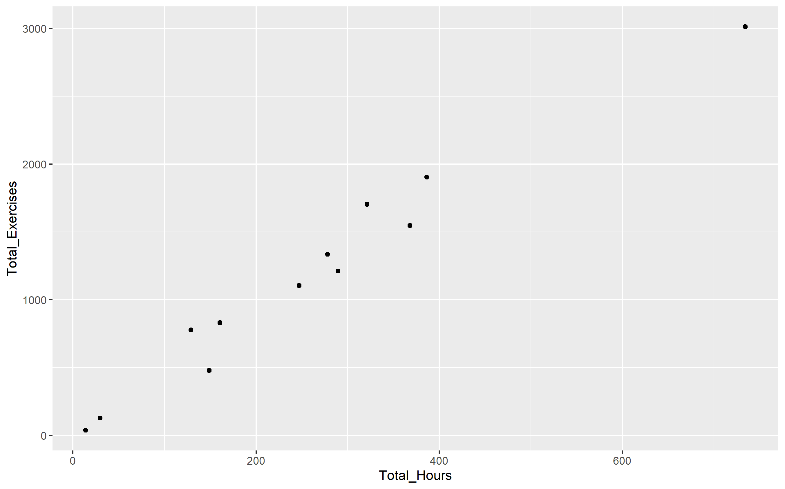

---
output:
  pdf_document: default
  html_document: default
---

# STAA57 Project Proposal
`Avoid deleting other people's work when possible (anything in backticks is not intended to be final and can be deleted)`
`Document Length: ~2 pages`

### Analysis Plan
`Specify questions to be addressed`

With the data given and additional data on monthly air traffic, weather and seasons, the following questions will be adressed by our analysis:
  
  - **How can scheduling be made the most efficient?
    - Is each instructor getting the appropriate number of hours?
    - Which season(s) see the best average student performance?
    - Time between each sessions
    - How many students come in every month/ how many sessions?
  
  - **What are the optimal conditions for student success?
    - Which training type yields the highest efficiency (by exercises completed per training hour)?
    - Exercises per hour of training (Only works for long term data)
    - Milestones achieved (Like flying solo, completing all exercises at least once?)
    - If solo flight hypothesis has significant correlation, school is doing well to judge when to do solo flights. If no correlation, flight school either is not judging solo        flights well or there is no relationship between when a student takes a solo flight and what they have accomplished.
    - *Instructor/student data relationship (Do some students fare better with certain instructors?)*
    
    Just a few questions I thought you should consider while writing the description.
    1) How long/many sessions did students train before flying solo?
    2) How long/many sessions did they fly dual? local? A particular aircraft?
    3) Was there a common set of exercises that was required?
    4) How was the first solo flight? (Did they fly solo again?)
    5) What was the weather like?
    6) Do our answers to the above questions change with instructors?
    7) How does the above information relate with students that never flew solo?
    
  - **What defines success/effectiveness of training?
    - Analysis for individual students' milestone that have hit milestones vs those who have not
    - Have all/most students who have flown solo done something the non-solo students haven't?    
    - **As an extension, can we determine what benchmarks students should/have to meet in order to fly solo?
  
In answering these questions, we made the assumption in analyzing our data that all students begin their training at the same skill level. Additionally, we assume there were no unmeasurable external factors impacting the duration or efficiency of sessions. That is to say, unless a factor can be measured, it cannot be accounted for in our analysis.

Our analysis plan consists of answering the following sub-questions related to the main questions we seek to answer:

Our group has several different approaches to getting the most useful conclusions out of this data.

### Data
`List/specify external data sources and types of data`
`R Code for importing data will not go in this section (since it is 100+ lines, ideally it goes in the appendix)`

To help determine when air traffic is the lowest, and thus flight accident risk is the lowest, we acquired air traffic data from the supplemmentary data. 
Air Traffic - https://open.canada.ca/data/en/dataset/b91772ed-edae-4fd4-8b80-a3e4c1d29976

To determine when flying is the safest (lowest wind, lowest precipitation), we used weather data from.
Weather data - https://climate.weather.gc.ca/historical_data/search_historic_data_e.html

### Preliminary Analysis
`Put in >= 3 graphs/DaVis' relating to analysis and comment on preliminary findings.`

To properly establish the  most efficient method of training students, first we must establish a measure of efficiency. By graphing exercises completed in each individual session, we determined that on a session by session basis, the exercises completed cannot be related to the duration of the session. However, by graphing the total session hours completed against the total exercises completed under each instructors supervision, we found that there is a significant correlation between training time and the number of exercises completed in the long term.

 `Maybe this will stay in here if we choose to use this efficiency metric. If not, it's at least a good template for inserting images`

Since both Total Hours and Total Exercises are roughly continuous, we can use calculate Pearson's Linear Correlation Coefficient
We found that r ~ 0.98, which shows strong positive correlation between the variables.

Given this, we concluded that for analysis spanning several months or years, the number of exercises completed per hour is a reliable efficiency metric.

### Appendix
`R Code for cleaning and importing data goes here (I am rewriting my code to be more space efficient. If I can compress it enough, I might be able to move it into the data section`
