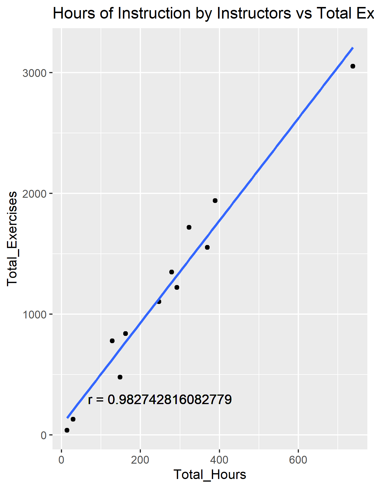

# STAA57 Project Proposal
`Avoid deleting other people's work when possible (anything in backticks is not intended to be final and can be deleted)`

### Analysis Plan
`Specify questions to be adressed`
With the data given and additional data on weather and seasons, the following questions will be adressed by our analysis: `Ideally we'll end up with 3 questions so  some may be      cut or combined to give more concrete analysis`
  - How can scheduling be made the most efficient?
    - Is each instructor getting the appropriate number of hours?
    - Which season(s) see the best average student performance?
    - Time between each session?
    
  - Instructor/student data relationship (Do some students fare better with certain instructors?) `The wording of this is unclear. Feel free to delete and reword this if you have    a better description`
  
  - How can students succeed the quickest?  `Success can be defined as flying solo, flying cross country, completing all exercises at least once?`
  
  - What factors makes a training session efficient?
    - 

`Describe data analysis plan`

### Data
`List/specify external data sources and types of data`
`R Code for importing data will not go  in this section (since it is 100+ lines, ideally it goes in the appendix)`

### Preliminary Analysis
`Put in >= 3 graphs/DaVis' relating to analysis and comment on preliminary findings.`

To properly establish the  most efficient method of training students, first we must establish a measure of efficiency. By graphing exercises completed in each individual session, we determined that on a session by session basis, the exercises completed cannote be related to the duration of the session. However, by graphing the total session hours completed against the total exercises completed under each instructors suppervision, we found that there is a significant correlation between training time and the number of exercises completed in the long term.

Given this, we concluded that for analysis spanning several months or years, the number of exercises completed per hour is a reliable efficiency metric.

### Appendix
`R Code for cleaning and importing data goes here (I am rewriting my code to be more space efficient. If I can compress it enough, I might be able to move it into the data section`
